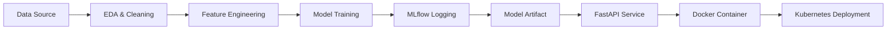

# MLOps Experimental Learning Assignment: Heart Disease Prediction

## 1. Objective

This project delivers an end-to-end machine learning solution for predicting heart disease risk using the UCI Cleveland dataset. The solution emphasizes reproducibility, experimentation, packaging, CI/CD, containerization, and deployment, in line with MLOps best practices.

## 2. Dataset and preprocessing

The dataset is obtained from the UCI Machine Learning Repository. It contains patient health records including age, sex, cholesterol, blood pressure, and other cardiovascular indicators. The script downloads and reads the dataset from the public source if it is missing locally. Missing values are handled during preprocessing and the target variable is separated from features.

The preprocessing pipeline includes:

- imputation for missing numeric values
- standard scaling for continuous numeric features
- one-hot encoding for categorical features
- model-safe handling of unknown categories

## 3. Modeling choice

Two models were trained and compared:

- Logistic Regression
- Random Forest Classifier

The best-performing model is selected based on ROC-AUC and evaluated against accuracy, precision, recall, and F1-score. This gives a balanced view of predictive quality in a medical setting.

## 4. Experiment tracking

MLflow is used to log:

- hyperparameters
- model metrics
- model artifacts
- experiment runs

This makes the training runs reproducible and auditable.

## 5. Reproducibility and packaging

The trained pipeline is serialized using `joblib` and saved as a reusable artifact. The project also includes a `requirements.txt` file to recreate the environment. The training logic uses a standard framework so a clean setup can train the final model reliably.

## 6. API service

A FastAPI service exposes a `/predict` endpoint. It accepts patient attributes as JSON and returns:

- predicted class
- predicted probability
- confidence level

The service also includes a `/health` endpoint used for operational checks.

## 7. CI/CD and automated testing

The project includes a GitHub Actions workflow that runs:

- dependency installation
- test execution
- model training verification

This ensures changes are validated automatically before deployment.

## 8. Containerization and deployment

The API is packaged in a Docker container and can be deployed locally or to Kubernetes. A sample Kubernetes deployment manifest is included in `k8s/deployment.yaml`.

## 9. Monitoring and logging

The API logs incoming request metadata and predicts server-side behavior. This provides an operational foundation for future Prometheus or Grafana integrations.

## 10. Deliverables summary

The repository contains:

- dataset acquisition script
- preprocessing and training pipeline
- MLflow experiment tracking
- model artifact serialization
- unit tests
- Dockerfile
- Kubernetes manifest
- GitHub workflow
- API service and documentation

## Conclusion

This project demonstrates a complete MLOps lifecycle for a healthcare classification problem: data preparation, testing, experiment tracking, packaging, deployment, and monitoring. It is suitable as a foundational implementation for ML operations in production-like environments.
