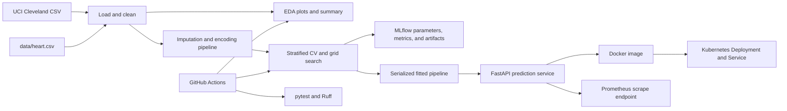

# Heart Disease Prediction: MLOps Project Report

**Course:** Machine Learning Operations (MLOps) AIMLCZG523

**Assignment:** 01, End-to-End ML Model Development and Deployment

**Submitted by:** Priyanshu Tripathi<br>
**BITS ID:** 2025ae05230

**Project status:** The nine written and technical assignment areas and their code, data, deployment, and screenshot evidence are implemented and verified.

## Executive summary

This project implements a reproducible classification workflow for the Cleveland subset of the UCI Heart Disease dataset. It covers dataset loading, exploratory analysis, leakage-aware preprocessing, comparison and tuning of two classifiers, MLflow experiment logging, model serialization, a FastAPI inference service, automated tests, a GitHub Actions workflow, Docker packaging, Kubernetes resources, and Prometheus-format service metrics.

The saved training summary selects Logistic Regression by mean five-fold cross-validation ROC-AUC. Its mean CV ROC-AUC is 0.9082 (standard deviation 0.0199). On the held-out test split, the saved summary reports accuracy 0.8689, precision 0.8125, recall 0.9286, F1 0.8667, and ROC-AUC 0.9632. These are results on a small, single-dataset evaluation and are not evidence of clinical usefulness or safety.

## 1. Problem and scope

The service predicts a binary target derived from the original Cleveland dataset target: `0` remains no detected disease, while original values `1` through `4` are mapped to `1`. The API accepts the 13 patient attributes and returns a binary prediction, the estimated probability of class 1, and confidence for the predicted class.

This is an educational engineering demonstration, not a medical device. It must not be used for diagnosis, triage, treatment, or other clinical decisions. No claim is made that the model is calibrated, representative of current populations, or suitable for deployment in healthcare.

## 2. Data acquisition and exploratory analysis

The source is the processed Cleveland file hosted by the [UCI Machine Learning Repository](https://archive.ics.uci.edu/ml/machine-learning-databases/heart-disease/processed.cleveland.data). `load_dataset()` downloads it to `data/heart.csv` only when the local file is absent. The checked-in CSV makes the current workflow runnable without relying on a live download.

The dataset contains 303 rows and 13 input features. The saved EDA summary reports four missing values in `ca` and two in `thal`; all other features and the target have no missing values. The binary classes are 164 records with target 0 and 139 with target 1. The target is therefore somewhat imbalanced, but not extremely so. The EDA command writes feature-distribution histograms, a correlation heatmap, and a class-balance plot to `artifacts/eda/`, with the counts recorded in `artifacts/eda/summary.json`.

Question marks in the source are parsed as missing values. Missing input features are retained until model fitting and imputed inside the pipeline. This avoids calculating imputation statistics from held-out rows. The target is converted to a binary indicator; feature values are parsed numerically and the model pipeline handles missing feature values.

## 3. Feature preparation and model development

The fixed input schema is declared in `FEATURE_COLUMNS` in `src/heart_disease_mlop/data_pipeline.py`. Continuous-valued features are median-imputed and standardized. Categorical features (`sex`, `cp`, `restecg`, `slope`, and `thal`) are imputed with the most frequent training value and one-hot encoded with unknown-category tolerance. `ca` is handled in the numeric transformer in the current implementation. All transformations are part of the serialized scikit-learn pipeline, so inference applies the same fitted preprocessing as training.

The data is divided once using an 80/20 stratified train/test split with random seed 42. Hyperparameters are selected using five-fold stratified cross-validation on the training partition. Grid search uses ROC-AUC as its refit/selection metric while also recording accuracy, precision, and recall. The tested models are class-weight-balanced Logistic Regression and Random Forest. The Logistic Regression grid tests `C` values 0.1, 1.0, and 10.0. The Random Forest grid tests 100 or 200 trees, unlimited or depth-6 trees, and minimum leaf sizes 1 or 2.

| Model | Best parameters | CV accuracy | CV precision | CV recall | CV ROC-AUC | Holdout accuracy | Holdout precision | Holdout recall | Holdout ROC-AUC |
| --- | --- | ---: | ---: | ---: | ---: | ---: | ---: | ---: | ---: |
| Logistic Regression | `C=0.1` | 0.8386 | 0.8506 | 0.7921 | 0.9082 | 0.8689 | 0.8125 | 0.9286 | 0.9632 |
| Random Forest | `max_depth=None`, `min_samples_leaf=2`, `n_estimators=100` | 0.8181 | 0.8186 | 0.7826 | 0.9001 | 0.8689 | 0.8125 | 0.9286 | 0.9448 |

CV entries are means over five folds; the full mean and standard deviation values and grid results are retained in `artifacts/training_summary.json` and `artifacts/evaluation/`. Both models have the same recorded holdout accuracy, precision, recall, and F1, while Logistic Regression has the higher CV and holdout ROC-AUC. The final pipeline is selected by CV ROC-AUC, not by the holdout score.

The holdout set is small, so individual examples can materially change the reported metrics. There is no external validation cohort, confidence interval for holdout metrics, prospective evaluation, or subgroup fairness analysis. The test-set figures should be interpreted as a reproducible benchmark for this assignment, not as a reliable estimate of future clinical performance.

### Libraries and methods

Versions below were verified in the local Python 3.12 project environment. `requirements.txt` specifies supported minimum versions rather than a fully pinned lock.

| Library (version) | Methods and role |
| --- | --- |
| pandas 3.0.6; NumPy 2.5.3 | `pd.read_csv(na_values="?")`, `pd.to_numeric`, DataFrame feature tables, CV result tables |
| scikit-learn 1.9.1 | `ColumnTransformer`, `Pipeline`, `SimpleImputer`, `StandardScaler`, `OneHotEncoder`; stratified `train_test_split` and `StratifiedKFold`; `GridSearchCV`; `LogisticRegression`, `RandomForestClassifier`, accuracy/precision/recall/F1/ROC-AUC metrics and confusion-matrix/ROC displays |
| MLflow 3.16.1; joblib 1.6.0 | `set_tracking_uri`, `set_experiment`, nested `start_run`, `log_params`, `log_metrics`, `log_artifact(s)`, `joblib.dump/load` |
| Matplotlib 3.11.2; Seaborn 0.13.2 | Feature histograms, `sns.heatmap`, `sns.barplot`, confusion-matrix and ROC plots |
| FastAPI 0.142.2; Pydantic 2.13.5; Uvicorn 0.54.0 | `@app.get/post` routes, `@app.middleware("http")`, `BaseModel`, `Field` range validation, ASGI serving |
| prometheus-client 0.26.0 | `Counter`, `Histogram`, `generate_latest` for request and latency instrumentation |
| pytest 9.1.1; Ruff 0.16.10 | `TestClient` API tests, data/preprocessor tests, Ruff E4/E7/E9/F static checks |

### Training and evaluation procedure

`train_best_model()` uses a stratified 80/20 holdout split (`random_state=42`) and five-fold `StratifiedKFold(shuffle=True, random_state=42)` within `GridSearchCV`. Each candidate is an sklearn `Pipeline`, so fold-specific imputers, scaler, and one-hot encoder are fit only on each fold's training rows. Accuracy, precision, recall, and ROC-AUC are scored; `refit="roc_auc"` chooses candidate parameters. The independent holdout set is used to report accuracy, precision, recall, F1, ROC-AUC and confusion-matrix/ROC diagnostics. The final model is the candidate with the higher mean CV ROC-AUC.

## 4. Experiment tracking and model packaging

Training creates an MLflow experiment named `heart_disease_prediction` under the local `mlruns/` directory. The run hierarchy records each model's parameters, cross-validation means and standard deviations, held-out metrics, serialized model artifact, grid-search table, and confusion-matrix/ROC diagnostics. The command `python -m src.heart_disease_mlop.train_model` repeats the split and search with the fixed seed and writes `artifacts/best_model.joblib`, per-model joblib files, evaluation artifacts, and `artifacts/training_summary.json`.

The complete preprocessing and estimator pipeline is saved together. The API loads this artifact at startup and falls back to training if the artifact is missing. This fallback is convenient for local development, but production deployment should bake a reviewed, versioned model artifact into the image or retrieve one from a controlled model registry. The checked-in joblib files must only be loaded from a trusted source because pickle-based formats can execute code during deserialization.

Install dependencies from `requirements.txt`. The README documents Python 3.12 setup, EDA, training, local MLflow UI, and command-line prediction. For a fully reproducible release, also record the exact dependency lock, dataset source/checksum, and training run identifier alongside each deployed model; the current requirements use lower bounds rather than a lock file.

## 5. Service, automated checks, and CI

`api/main.py` provides a FastAPI service with:

- `GET /health` for service and model readiness.
- `POST /predict` for a validated patient feature record and prediction/probability/confidence response.
- `GET /metrics` for Prometheus request counters and request-duration histograms.

The request middleware logs method, route, status, and duration. It deliberately does not log patient feature values. Pydantic constraints reject out-of-range coded values and negative measurements. The unit tests exercise health, prediction response shape, and metric exposure; data-pipeline tests cover data preparation behavior.

The GitHub Actions workflow installs the declared dependencies, runs Ruff checks and pytest, trains the models and generates EDA outputs, then uploads artifacts. It is configured for pushes and pull requests to `main` and `master`. The first hosted run exposed missing pytest import paths; `pytest.ini` now adds both the project root and `src`. The latest hosted run [#7 passed](https://github.com/priyansh1114/MLops/actions/runs/36999886352), including lint, all five tests, training, EDA and artifact upload. The [heart-disease-mlops-artifacts bundle](https://github.com/priyansh1114/MLops/actions/runs/36999886352/artifacts/11223470815) is available. The included screenshot records a prior successful hosted run #4.

## 6. Architecture



## 7. Container and Kubernetes deployment

The `Dockerfile` uses Python 3.12 slim, installs `requirements.txt`, copies the project, and starts Uvicorn on port 8000. The documented local verification is to build `heart-disease-api`, run it with port 8000 published, then call `/health` and `/predict` or use `/docs`.

`k8s/deployment.yaml` declares two replicas, readiness and liveness checks against `/health`, Prometheus scrape annotations, and a `LoadBalancer` Service. The manifest references `heart-disease-api:latest`; the image must be built and made available to the selected cluster before applying it. For Minikube, the README describes loading the image and using `minikube tunnel` for the local LoadBalancer address. `monitoring/prometheus.yml` defines a scrape configuration for the API metrics endpoint.

**Verified Docker deployment:** the `heart-disease-api:latest` image built successfully and ran as `heart-disease-api-local` on host port 8000. `/health` returned `{"status":"ok","model_loaded":true}`; a sample `/predict` returned HTTP 200 with prediction 1, probability 0.7242, and confidence 0.7242; `/metrics` returned HTTP 200 with request counters and latency histograms. Screenshots are saved in `screenshots/`.

**Verified Kubernetes deployment:** Docker Desktop Kubernetes context `docker-desktop` was configured and its node reached `Ready`. The `heart-disease-api` Deployment reached 2/2 available replicas; the LoadBalancer Service was assigned cluster address `172.18.0.5`. This cluster has a separate containerd image store, so the local image was imported into Kubernetes containerd and the manifest uses `imagePullPolicy: Never`. Through `kubectl port-forward service/heart-disease-api 8080:80`, `/health` returned `{"status":"ok","model_loaded":true}` and a sample `/predict` returned prediction 1 with probability/confidence 0.7242. Screenshots are saved in `screenshots/`.

The verified API request logs and Prometheus metrics cover the assignment's simple metrics/logs monitoring option; no separate Grafana server was launched. No public URL is claimed. Do not publish patient data in screenshots or logs.

## 8. Reproduction and verification procedure

From the repository root, create and activate a Python 3.12 virtual environment, install `requirements.txt`, then run:

```powershell
ruff check --select E4,E7,E9,F src api tests
pytest -q
python -m src.heart_disease_mlop.eda
python -m src.heart_disease_mlop.train_model
```

To run the API locally, use `uvicorn api.main:app --host 127.0.0.1 --port 8000`. Verify `/health`, submit a representative 13-feature JSON body to `/predict`, and inspect `/metrics`. To browse local MLflow runs, set `MLFLOW_ALLOW_FILE_STORE=true` and run `mlflow ui --backend-store-uri ./mlruns --host 127.0.0.1 --port 5000` (PowerShell path syntax may use `.`/`\` as in README).

The Docker build, local container checks, and Docker Desktop Kubernetes rollout above have been executed. The checked-in `pytest.ini` includes the repository root and `src` on pytest's import path so tests can import application packages in GitHub Actions as well as locally.

## 9. Limitations, safety, and next steps

The Cleveland dataset is small, historical, and not established as representative of the intended deployment population. There is no data governance assessment, clinical validation, calibration study, decision-threshold analysis, fairness evaluation, drift detection, alerting policy, or human review workflow. Prometheus endpoint instrumentation provides request volume and latency signals, but it is not a complete monitoring system: it does not measure model quality or data drift and no Grafana dashboard is supplied.

Before any real-world use, the project would require an appropriately governed and representative dataset, clinical and regulatory review, independent validation, calibration and subgroup analyses, privacy/security review, a defined human decision process, and ongoing monitoring with tested rollback procedures. The 10-page PDF embeds all captured Docker, Kubernetes and CI screenshots, and the hosted CI run URL and artifact are provided.

## 10. Artifact index

| Artifact | Purpose |
| --- | --- |
| `data/heart.csv` | Local Cleveland dataset snapshot |
| `artifacts/eda/` | EDA plots and data summary |
| `artifacts/training_summary.json` | Selected model and saved metric summary |
| `artifacts/evaluation/` | Grid-search tables and holdout diagnostic plots |
| `artifacts/best_model.joblib` | Selected full preprocessing/model pipeline |
| `mlruns/` | Local MLflow experiment store |
| `api/main.py` | FastAPI prediction and metrics endpoints |
| `tests/` | API and data-pipeline tests |
| `.github/workflows/ci.yml` | Lint, test, train, EDA, and artifact-upload workflow |
| `Dockerfile`, `k8s/deployment.yaml` | Container and Kubernetes deployment definitions |
| `scripts/load_docker_desktop_image.ps1` | Imports the local image into Docker Desktop Kubernetes containerd |
| `monitoring/prometheus.yml` | Prometheus scrape configuration |
| `report.pdf`, `report.html` | Ten-page PDF submission and printable source |
| `screenshots/` | Screenshots captured from the Docker API and Kubernetes deployment |
| `pytest.ini` | Project and `src` import paths for local and CI tests |

This report maps each of the nine written and technical assignment areas to its implementation and evidence. The repository includes the code, data, scripts, test suite, workflow, report, screenshots, Docker image, and verified local Kubernetes service.
